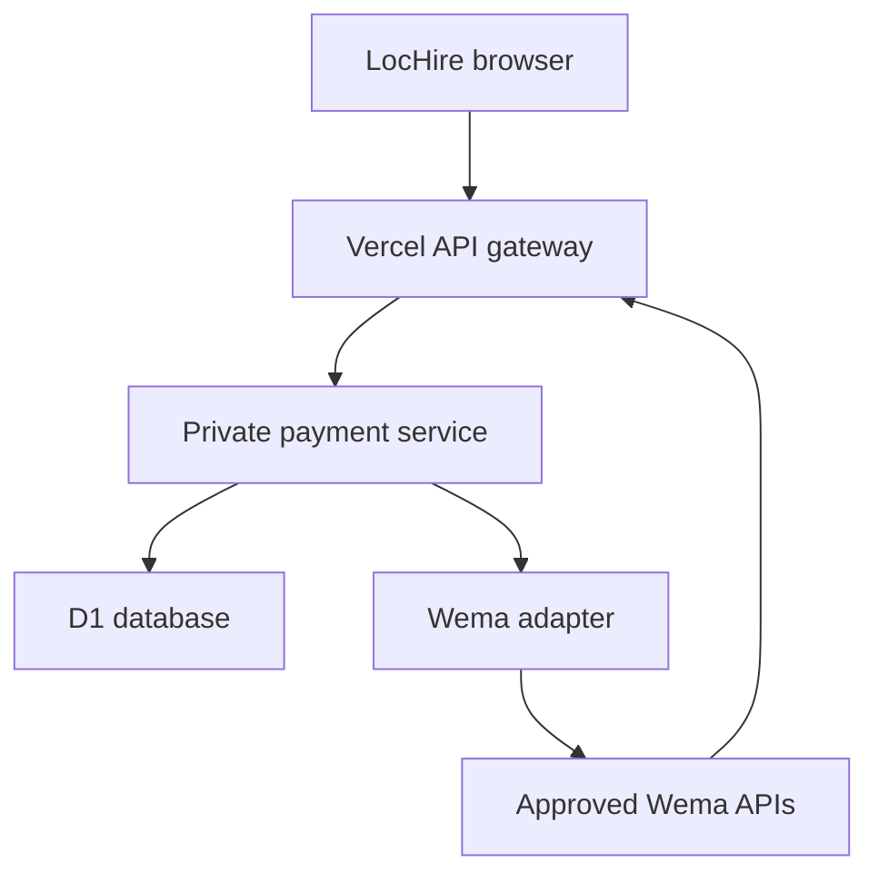

# LocHire

**Find local workers. Find work near you.** LocHire connects artisans, domestic workers and everyday service providers to households and businesses. Its payment layer keeps a job's scope, price, payment and receipt together, with a Wema-ready bank adapter.

**Live app:** https://lochire.vercel.app/

**Wallet:** https://lochire.vercel.app/#wallet

The wallet is a working, authenticated **test-money** application with persistent server records. Wema account creation and real bank transfers remain disabled until Wema provides approved product access, credentials and verified request/callback contracts. Test balances are never real bank balances.

## What is ready

| Area | Working behavior |
|---|---|
| Local hiring | Worker/employer profiles, jobs/tasks, nearby discovery, invitations, terms, completion and eligible 1–5-star reviews |
| Wallet accounts | Registration, sign-in/out, hashed passwords, HttpOnly session cookies, separate users and records across devices |
| Test funds | Add test funds, view available/reserved balances, fund accepted jobs, return funds on eligible cancellation |
| Payment agreements | Employer chooses a registered worker's wallet ID; worker accepts immutable scope and price before funding |
| Completion | Each side confirms completion; reserved test payment releases to the worker once, after both confirmations |
| History and receipts | Server-saved transaction references, filters, related jobs, private receipt views and text downloads |
| Reputation | Completed payment-job counts, participant ratings and positive-review percentages with sample counts; no guaranteed reliability badge |
| Disputes | Record a test dispute and freeze test funds; no automatic release or live administrator notification |
| Wema preparation | Optional bank onboarding UI, NIN/OTP adapter, debit/beneficiary enquiries, transfer/authorization/requery handlers and consent-based statements |
| Deployment | Existing Vercel app and gateway plus private Sites/Cloudflare D1 payment service; credentials stay server-side |

## Understand the two data areas

**Hiring examples** remain in browser localStorage under `lochire-local-demo-v3`. They are fictional or visitor-created local demonstrations, not shared live worker listings. Local counterpart previews are not authenticated wallet accounts. GPS sharing is optional, approximate and expires. Email actions prepare drafts/open the visitor's mail app; no email is automatically delivered.

**Wallet accounts and payment jobs** are authenticated and saved in the backend database. Employers and workers sign into their own accounts and see the same payment agreement across devices. Only owners can access their balances/receipts, and only participants can act on a job. Resetting local hiring examples does not erase wallet data.

A local hiring record can prefill a new payment agreement, but cannot authorize payment. A registered worker must provide their wallet ID and accept the new server-saved scope and amount. Browser-supplied user IDs never establish the signed-in payer.

## Try the complete payment demo

1. Open **Wallet** and create a worker test account with fictional details. Copy its `LH-…` wallet ID.
2. Sign out and create an employer account, or use a second device/private browser session.
3. Add ₦50,000 test funds. Create a ₦20,000 payment agreement with the copied worker ID and clear scope.
4. Sign in as the worker and accept the agreement under **Payment jobs**.
5. Sign in as employer and reserve payment. Available becomes ₦30,000 and Reserved becomes ₦20,000.
6. Mark the worker's side completed. Payment stays reserved until the employer also confirms.
7. Confirm as employer. The worker receives ₦20,000 test funds once. Open/download the receipt and leave an eligible review.

See [the judge demo](docs/DEMO.md) for a short walkthrough and Wema talking points.

## Architecture



`api/[...path].js` forwards requests with server-only service credentials. The browser keeps an opaque HttpOnly session cookie. The service authorizes each operation using that session and participant ownership. D1 stores accounts, ledger, jobs, idempotency operations, reviews and bank requests. Bank callbacks enter through Vercel, then undergo bank-specific authentication and independent bank requery.

Money is integer **kobo**, with nonnegative database constraints. Money-changing batches atomically check the current job and balance. An idempotency row guards the transaction. Duplicate requests return the existing result or reject changed details instead of moving money again. Concurrent jobs cannot reserve the same funds.

## Wema integration

The intended real-money path is: optional consenting Wema wallet setup → worker accepts a Wema payment agreement → employer confirms password → bank debit authorization → independent verification → job-linked history/receipts.

The bank path is a direct transfer between confirmed Wema wallets. Test reserve/release does not imply a live escrow product; Wema must approve any real holding arrangement. A bank account check does not promise "100% reliability".

Read [WEMA-INTEGRATION.md](docs/WEMA-INTEGRATION.md). It lists official API references, bank questions, environment variables, callback URLs and subscription-specific mappings isolated in `payment-backend/lib/wema.mjs`. A key alone is insufficient if Wema has not supplied product schemas, callback security and independent status endpoints. These final mappings do not require rebuilding the wallet or hiring UI.

No Wema account number is invented. `LH-…` is an application ID, not a bank account number. NIN and OTP are not collected in test mode and are never persisted by the bank onboarding adapter.

## Repository guide

| Path | Purpose |
|---|---|
| `index.html`, `style.css`, `app.js`, `domain.js` | Hiring UI and domain rules |
| `wallet.js`, `wallet.css` | Account, wallet, payment-job, receipt and bank setup UI |
| `api/[...path].js` | Server-side Vercel gateway |
| `payment-backend/` | Complete private backend source snapshot, schema, migrations and tests |
| `payment-backend/lib/service.mjs` | Auth, authorization, atomic ledger, jobs, reviews and callbacks |
| `payment-backend/lib/wema.mjs` | Bank HTTP adapter, verification and encrypted mandates |
| `payment-backend/db/schema.ts`, `payment-backend/drizzle/` | Database schema and migrations |
| `docs/API.md` | Routes, request fields, money units and error/idempotency behavior |
| `docs/WEMA-INTEGRATION.md` | What to get from Wema and activation steps |
| `docs/DEMO.md` | Hackaholics demonstration script |

## Development and checks

Production and the SQLite-backed service tests use Node 24.

```sh
npm ci
npm run build
npm test
node --test payment-backend/tests/payments.test.mjs
```

For static hiring-screen development, serve `dist` locally. The wallet needs the gateway and configured backend; a static HTTP server alone cannot run it. Use `vercel dev` from the linked LocHire project with the root `.env.example` variables. Match `APP_ORIGIN` in gateway and backend for a local origin.

The standalone backend retains the Sites Vinext starter. Update its schema with `npm run db:generate`; publish through the Sites source/build workflow to apply migrations and deploy a saved version. Local and hosted databases are separate. Keep applied migrations immutable and append changes.

The root build copies only public assets into `dist`; Vercel discovers root `api/` separately. Backend source is excluded from the frontend function bundle and public asset output.

## Deployment and environment

Vercel production project: `lochire`, public domain `lochire.vercel.app`. The private payment service is identified in `payment-backend/.openai/hosting.json`; preserve that exact ID and its `DB` binding when updating.

Gateway settings are already configured: `APP_ORIGIN`, `PAYMENT_BACKEND_URL`, `PAYMENT_SERVICE_SECRET`, `PAYMENT_BACKEND_ACCESS_TOKEN`. Secret values remain in server runtime settings, outside GitHub and the browser.

Backend settings: `SERVICE_SECRET`, `APP_ORIGIN`, `PAYMENT_MODE=sandbox`, `WEMA_ENABLED=false`, plus the bank variables in the integration guide. Keep the backend owner-private.

Git pushes to the connected production branch update the Vercel frontend/gateway. The private backend has a separate Sites source/save/deploy workflow: editing its GitHub source snapshot alone does **not** deploy it. Update the backend deployment and snapshot together when changing service logic.

## Validation and current limits

Tests cover the existing hiring journeys plus payment ownership, insufficient funds, concurrent reservations, duplicate funding/completion/cancellation, refunds, dispute freezing, review eligibility, receipt isolation, invalid origins, logout, request limits and bank amount/account/mandate mismatch rejection. Real Wema calls need approved sandbox access.

This is ready for a **test-money hackathon demonstration**, not a real-money pilot. Test email/phone confirmation and password recovery are not connected. Hiring listings/messages and identity/reference checks retain their local-demo boundaries. Disputes have no operational resolution queue. Bank-confirmed reversals, custody approval, support and bank production authorization are needed before offering those services.

Never print or commit secrets, passwords, NIN, OTP, bank payloads or session cookies.
